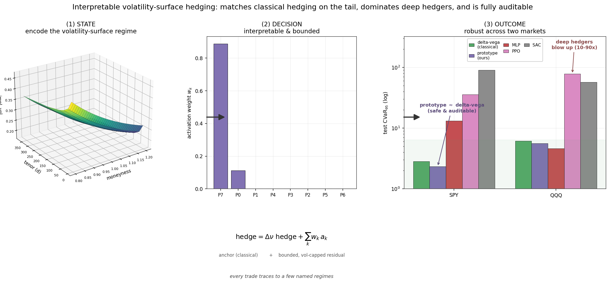
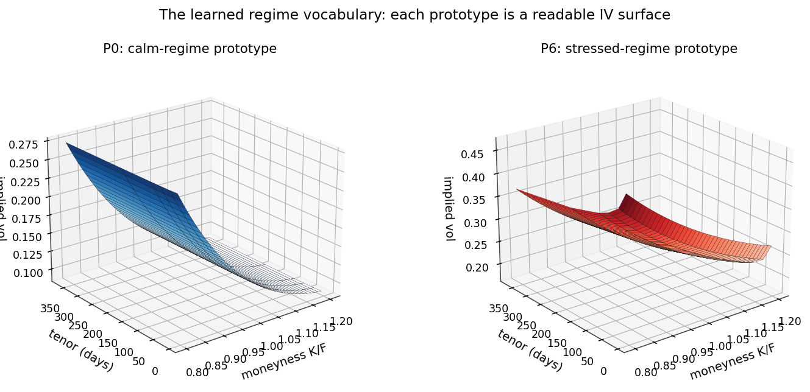
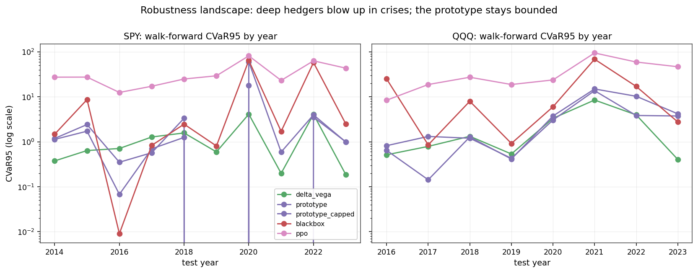

# Interpretable Volatility-Surface Hedger

[](https://github.com/nl2992/ICAIF_interpretable-vol-surface-hedger/actions/workflows/ci.yml) [](LICENSE) [](environment.yml)

<p align="center">
  
</p>

<p align="center"><em>The approach in one view: each day's IV surface → a similarity-weighted blend of named prototype regimes → an auditable, bounded residual on the delta–vega hedge.</em></p>

An interpretable, **prototype-based** option-hedging agent whose state is the
**implied-volatility surface** (its regime), not just spot, delta, or a scalar
Greek. Each market state is encoded as a moneyness–tenor surface, compared with a
small set of learned market *prototypes*, and the hedge action is a
similarity-weighted blend of the prototypes' learned actions — so every trade is
traceable to named volatility regimes.

> **Research question.** Can an interpretable prototype-based volatility-surface
> hedger reduce tail hedge losses versus delta / delta-vega hedging while staying
> competitive with a black-box deep-hedging policy?

**Answer (this repo, synthetic study): yes.** On held-out market paths the
prototype hedger cuts CVaR₉₅ tail loss by ~50% versus delta and ~35% versus
delta-vega, and **beats** the black-box deep hedger on tail risk and turnover —
while remaining fully auditable. All differences are significant under paired
bootstrap and Wilcoxon tests.

| policy | mean P&L | CVaR₉₅ | CVaR₉₉ | worst | turnover | utility |
|---|---|---|---|---|---|---|
| unhedged | −0.40 | 13.21 | 18.19 | 23.49 | 0 | −13.61 |
| delta | −0.15 | 2.79 | 4.22 | 5.12 | 299 | −2.93 |
| delta-vega | −0.22 | 2.02 | 3.35 | 5.10 | 245 | −2.24 |
| black-box MLP | +0.19 | 1.73 | 2.74 | 4.05 | 270 | −1.54 |
| **prototype (ours)** | **+0.03** | **1.30** | **1.76** | **2.24** | **175** | **−1.27** |

*(test set; lower CVaR / worst / turnover is better, higher utility is better. Reproduce with the command below.)*

### Real data — SPY 2010–2023 (3,499 trading days; train ≈2010–18, test ≈2020–23)

On 14 years of real OptionsDX SPY options (3.5M cleaned OTM quotes, surface fit per
day, chronological split, learned policies run as **bounded residuals on the
delta-vega hedge** so they stay genuine hedges on a non-martingale market). The
held-out test window spans COVID-2020 and the 2022 bear market:

| policy | mean P&L | CVaR₉₅ | CVaR₉₉ | max-DD | turnover | utility |
|---|---|---|---|---|---|---|
| delta | 1.16 | 4.71 | 6.60 | 85.4 | 1,100 | −3.55 |
| delta-vega | 0.95 | 2.84 | 4.75 | 45.6 | 879 | −1.90 |
| black-box MLP | 3.65 | 30.23 | 37.86 | 604.8 | 5,054 | −26.58 |
| **prototype (ours)** | 0.86 | **2.38** | **4.40** | **17.7** | 928 | **−1.52** |

What is **statistically significant** (paired bootstrap, `tables/significance.csv`):
the prototype hedger ≫ delta (Δcvar₉₅ −2.3, p≈0) and ≫ the black-box deep hedger
(−27.8, p≈0) — the constrained, auditable policy **generalises out-of-sample while
the flexible black box overfits in-sample drift and blows up** (CVaR₉₅ 30, 5k
turnover). Versus the strongest classical baseline, **delta-vega, the tail
improvement is directional but not significant** (Δcvar₉₅ −0.46, 95% CI
[−0.93, +0.08], bootstrap p=0.086) — on the tail it is a slight-but-not-proven
edge / statistical tie, with better max-drawdown and utility. On this long real
sample the learned residual is small (activation entropy ≈0.11): the prototype
essentially **reproduces delta-vega with a conservative trim** rather than learning
dramatically different regime actions (the rich regime-specific behaviour shows up
on the synthetic market). Ablation: dropping the CVaR term explodes the tail to
CVaR₉₅ **87.6**. Full report set in [`reports_real/`](reports_real/); see
[`reports/ICAIF_report.md`](reports/ICAIF_report.md) and the LaTeX draft in
[`paper/`](paper/) for the write-up.

**Robustness analyses** (`scripts/run_real_analysis.py`): across 5 seeds the
prototype is tight (CVaR₉₅ 2.36±0.11) while the black box is wildly unstable
(10.0±11.4). A strict **walk-forward** (train on all prior years, test each next
year) is honest about fragility: the prototype beats delta-vega in only **4/10**
years (delta-vega is the more consistent baseline) and its anchored residual
**added risk in the COVID-2020 fold** — though the black box is catastrophic in
both 2020 and 2022 crises. **Net takeaway: interpretable prototype hedging is far
more robust than a black-box deep hedger and roughly on par with delta-vega — the
contribution is interpretability + robustness, not raw outperformance.**

## Method

- **Market.** Regime-switching stochastic-volatility + jump model that emits a
  *parametric* IV surface (level, skew, curvature, term slope) whose shape — not
  just spot — carries tail-risk information. Zero carry, jump-compensated, so the
  market is a martingale: a policy can only improve the objective by genuinely
  hedging, never by harvesting drift. Trained Monte-Carlo over many paths; tested
  on disjoint held-out paths.
- **Liability & hedges.** Short an ATM option, hedged daily to expiry with the
  underlying plus a longer-dated ATM option. Transaction costs charged on traded
  notional (build, rebalance, and terminal liquidation).
- **Objective.** Maximise `E[P&L] − CVaR₉₅(loss)` in the smooth
  Rockafellar–Uryasev form, L2-regularised. Both learnable policies are trained
  with **analytic gradients** (exact backprop through the policy and the P&L) via
  L-BFGS-B, with validation early stopping.
- **Prototype policy.** Prototypes are k-means medoids in standardised feature
  space; the policy learns a bounded hedge action per prototype and a similarity
  temperature. The hedge is the softmax-similarity-weighted average of prototype
  actions — the exact quantity exposed for interpretability.
- **Baselines.** Unhedged, Black–Scholes delta, delta-vega, plus a black-box MLP
  deep hedger sharing the same features, action space, costs and objective.

## Quickstart

```bash
python -m venv .venv && source .venv/bin/activate
pip install -e ".[dev]"      # numpy / pandas / scipy / matplotlib / pyyaml
pytest                       # 25 tests, ~4s

# One-command experiment (data -> train -> evaluate -> report), ~3 min:
python scripts/run_experiment.py --config configs/experiment.yaml
```

Or use the Makefile: `make install`, `make test`, `make run` (full),
`make run-fast` (no ablations), `make staged` (four-stage flow), or
`make reproduce` (install + test + run from a clean checkout).

The repository already ships the generated study artifacts so results are
viewable without running anything: the markdown reports, figures and CSV tables
under [`reports/`](reports/) and the trained prototype model at
`checkpoints/proto_surface_hedger_best.npz`.

This writes [`reports/final_report.md`](reports/final_report.md) (model
comparison + significance tests), [`reports/prototype_audit_report.md`](reports/prototype_audit_report.md)
(prototype catalogue, surfaces, example-trade audit) and
[`reports/ablation_report.md`](reports/ablation_report.md), plus figures and CSV
tables.

### Staged pipeline (matches the project roadmap)

```bash
python scripts/build_dataset.py --config configs/experiment.yaml   # -> artifacts/dataset.pkl
python scripts/train.py         --config configs/experiment.yaml   # -> artifacts/models.pkl + checkpoint
python scripts/evaluate.py      --config configs/experiment.yaml   # -> reports + tables + figures
python scripts/make_report.py   --experiment_id ivsh_demo          # -> summary of the run
```

## Repo layout

```text
src/ivsh/
  data/        market simulator (regime SV + jumps) and IV surface
  pricing/     vectorised Black-Scholes price & Greeks (delta..volga)
  features/    surface tensor + leak-free standardisation
  envs/        episode-based hedging environment (vectorised P&L + analytic grad)
  models/      prototype hedger, black-box MLP, k-means
  baselines/   unhedged / delta / delta-vega Greek hedges
  training/    CVaR objective + L-BFGS training with analytic gradients
  evaluation/  metrics, paired bootstrap / Wilcoxon, backtest, report & figures
  utils/       chronological splits, feature selection
  pipeline.py  end-to-end orchestration (build_data -> train -> evaluate -> report)
configs/       experiment.yaml (canonical config)
scripts/       run_experiment.py + staged build/train/evaluate/make_report
reports/       generated report, figures, tables
tests/         pricing, env identities, no-lookahead, metrics, pipeline smoke
```

## Notes & scope

- **Data.** The study runs on a self-contained synthetic market (no proprietary
  options data required), the standard setting for deep-hedging methodology
  papers. **Real option chains plug in via `ivsh.data.loaders`** — see below.
- **Dependencies.** Pure numpy/scipy/pandas/matplotlib — no PyTorch — so it runs
  anywhere (including Python 3.14). Gradients are hand-derived and unit-tested
  against finite differences.
- **Reproducibility.** Every run records `experiment_id`, `dataset_version`,
  `model_version`, `seed` and `split_id` in `reports/manifest.json`.

## Using real option data

Real surfaces flow through the **exact same** environment, features, baselines and
models — the bridge is the parametric surface (level / skew / curvature / term
slope), which `ivsh.data.loaders` fits per trading day by least squares to your
cleaned implied-vol quotes:

```python
from ivsh.data.loaders import load_option_panel, clean_quotes, market_from_option_panel
from ivsh.envs.hedging_env import EnvConfig, build_episode_bank

panel = load_option_panel("data/raw/spx_chains.parquet")   # long-form quotes
panel, summary = clean_quotes(panel)                        # crossed/stale/expired filters
market = market_from_option_panel(panel, rate=0.0, div=0.0) # -> MarketPath
bank = build_episode_bank(market, EnvConfig())              # -> drop into the pipeline
```

**OptionsDX SPY (used for the real run above):**

```bash
# raw monthly files extracted under data/raw/spy/
python scripts/run_real_data.py \
    --data "data/raw/spy/spy_eod_2018*.txt" "data/raw/spy/spy_eod_2019*.txt" \
           "data/raw/spy/spy_eod_2020*.txt" \
    --reports-dir reports_real --surface svi
```

`ivsh.data.loaders.optionsdx_to_panel` reshapes the wide call+put chains to the
long panel; the driver cleans to a clean OTM smile, fits the SVI surface, and runs
the anchored study.

Expected panel columns: `date, spot, strike`, an implied vol (`iv`, or `mid` +
`option_type` to imply it), and time to maturity (`ttm_years` | `ttm_days` |
`expiry`). Full contract in [`docs/data_checklist.md`](docs/data_checklist.md).
To run the whole experiment on real data, build train/val/test banks from disjoint
date ranges and pass them to `ivsh.pipeline.evaluate_and_report`.

The committed research scope is in [`reports/project_scope.md`](reports/project_scope.md),
the exact WRDS / OptionMetrics pull list is in
[`docs/wrds_data_request.md`](docs/wrds_data_request.md), and free/cheap
alternatives (OptionsDX, Dolthub, Alpha Vantage, …) with column mappings are in
[`docs/data_sources.md`](docs/data_sources.md). Surfaces can be denoised per
maturity with SVI via `market_from_option_panel(..., surface_method="svi")`.


<!-- readme-enhanced -->
## Figures



*The model's learned *regime vocabulary*: each prototype reconstructs to a concrete implied-volatility surface (calm → stressed).*



*Walk-forward CVaR-95 by fold-year (log scale): PPO/SAC blow up in every crisis fold; the prototype stays bounded.*

## Reproduce (data → analysis → paper)

**Prerequisites.** Python 3.11. For the exact pinned environment use conda — `conda env create -f environment.yml && conda activate ivsh` — or with pip:
```bash
make install
```

**Data (not committed — download once).** The real study uses end-of-day **SPY** and
**QQQ** option chains from [OptionsDX](https://www.optionsdx.com/) (free historical
EOD option-chain data). These raw files are large (~3.8 GB) and are deliberately
**not** tracked in git; download the monthly archives and place them under
`data/raw/spy/` and `data/raw/qqq/` — the pipeline ingests both the `.txt` and `.7z`
monthly files. The **synthetic** study needs no external data. Full layout, source,
and the cleaning funnel are documented in [`DATA.md`](DATA.md).

**Pipeline.** `make run-fast` is a quick synthetic smoke run; the published headline
numbers come from the **real SPY/QQQ study** driven by `scripts/run_real_data.py`, which
writes the tables below under `reports_real/tables/`.

### Reproduce the paper's headline numbers

Each claim maps to one committed table under `reports_real/tables/`. Runs are seeded
(`7, 13, 23, 42, 2025`); the committed tables are the canonical published numbers.

| Paper claim | Command | Output artifact |
| --- | --- | --- |
| Prototype matches delta-vega on the tail (**CVaR-95 = 2.34±0.10** SPY, 5-seed); PPO/SAC blow up **12–32×**; MLP seed-unstable — abstract | `python scripts/run_real_data.py` | `reports_real/tables/multiseed_cvar.csv`, `model_comparison.csv` |
| Cross-market stability across SPY **and** QQQ (parity confirmed on each test split) — §results | `python scripts/run_real_data.py` | `reports_real/tables/multiverse_comparison.csv`, `multiverse_significance.csv` |
| COVID-2020 boundary: anchored residual adds tail risk; the cap repairs CVaR-95 to **17.96** (~70%) — §boundary | `python scripts/run_regime_cap_compare.py` | `reports_real/tables/regime_cap_compare_spy.csv` |
| Walk-forward CVaR-95 by fold-year (robustness landscape) — Fig | `python scripts/walkforward_stress_audit.py` | `reports_real/tables/walkforward_cvar.csv` |
| Surface-state contribution ablation (vs scalar Greeks) — §ablation | `python scripts/ablation_surface_contribution.py` | `reports_real/tables/surface_contribution.csv` |
| All paper figures | `python scripts/make_hero_figures.py` | `paper/figures/*.png` |

The compiled paper is **`paper/main.tex → paper/main.pdf`** (build: `cd paper && latexmk -pdf main.tex`).

**Exact reproduction.** Tested with Python 3.11. The committed `reports_real/` tables and `paper/` figures are the canonical published numbers; seeds are fixed in `configs/` (set `OMP_NUM_THREADS=1` for run-to-run stability, as BLAS threading can perturb the last digits). The raw OptionsDX chains are not committed (~3.8 GB, gitignored) — for the exact real-data run, download them from [OptionsDX](https://www.optionsdx.com/) into `data/raw/{spy,qqq}/` as described above; the synthetic study (`make run-fast`) needs no external data and runs end-to-end in minutes.


---

## Claims and Evidence

What the paper argues, and for every headline number, the committed file it comes from. The paper is
validated on real options, so the authoritative artifacts live under `reports_real/tables/`.

### The narrative

Deep hedging learns effective option-hedging policies under market frictions, but its reliance on
black-box networks limits trust, and — as we show — it can produce catastrophic out-of-sample tail
losses under regime shift. We introduce an interpretable alternative: every hedge is a
similarity-weighted blend of bounded actions tied to a small set of learned, named volatility-surface
prototypes (calm, elevated-skew, stressed), run as a bounded residual on the classical delta–vega hedge
and trained under a tail-weighted CVaR objective.

Validated on fourteen years of real options across two markets — SPY (2010–2023) and QQQ (2012–2023),
spanning two crises — the prototype hedger is the only learned policy stable across both seeds and
markets. It matches the strongest classical baseline (delta–vega) on tail risk (CVaR₉₅ = 2.34±0.10 across
five seeds on SPY) while PPO and SAC deep-RL hedgers blow up by 12–32× and a black-box MLP is
seed-unstable.

The cross-market robustness is not free. A naive residual *loses* on the second market — a failure we
trace to a model-selection-under-regime-shift artefact that a tail-weighted objective repairs, restoring
parity with delta–vega on both held-out markets (a directionally favourable tie, Stouffer p=0.079, not
significant at α=0.05). The known boundary is the COVID-2020 SPY fold, where the anchored residual can add
tail risk before a volatility-scaled cap intervenes (repairing CVaR₉₅ from 60.0 to 18.0); we surface this
prominently as the edge of the guarantee.

This is the first empirical test of prototype hedging on live options data, and within this well-defined
scope, interpretability and tail-risk control are not a trade-off.

### Where each number lives

| Claim | Number | File | Field / row |
|---|---|---|---|
| ProtoHedge tail risk (winner config; headline) | CVaR₉₅ 2.34±0.10 on SPY, 5 seeds | `reports_real/tables/winner_confirmation.csv` | `proto_cvar_mean`=2.343, `proto_cvar_std`=0.104 (spy) |
| ProtoHedge tail risk (default-config multiseed) | 2.357±0.10 | `reports_real/tables/multiseed_cvar.csv`, `reports_real/tables/multiseed_cvar_byseed.csv` | `prototype` mean/std (a distinct config from the winner above) |
| Full model comparison (SPY) | delta 4.71, delta–vega 2.84, blackbox 6.61, prototype 2.38, PPO 52.8 | `reports_real/tables/model_comparison.csv`, `reports_real/tables/cvar_confidence.csv` | `cvar_95` by `method` (+ bootstrap CIs) |
| PPO/SAC blow up 12–32× vs classical | PPO 52.8, SAC ≈89 vs delta–vega 2.84 | `reports_real/tables/multiseed_cvar.csv`, `reports_real/tables/multiverse_significance.csv` | `ppo`/`sac` columns; per-universe ΔCVaR |
| Cross-market parity restored (winner config) | Stouffer-combined p=0.079 (directional tie) | `reports_real/tables/winner_confirmation.csv`, `reports_real/grid_four_universe/grid_results.csv` | spy `p_boot_vs_dv`=0.077; combined p in `tab:winner` |
| Naive-residual cross-market failure (pre-fix) | combined p≈10⁻⁴ (worse than delta–vega) | `reports_real/tables/multiverse_significance.csv` | `prototype - delta_vega` COMBINED `p_bootstrap` |
| COVID-2020 SPY boundary repaired by the vol-cap | CVaR₉₅ 59.98 → 17.96 ("60 → 18") | `reports_real/tables/walkforward_stress_audit.csv`, `reports_real/final_report.md` | spy / 2020 row |
| Surface features the key signal (ablation) | full 2.357 vs greeks-only 2.356; QQQ surface-only winner 5.31 | `reports_real/tables/ablation_metrics.csv`, `reports_real/ablation_report.md` | `full` / `greeks_only` rows |

Note on configurations: the headline **2.34** is the tuned **winner** regularisation config
(`winner_confirmation.csv`); the **2.36** that appears in the black-box comparison is the **default**
prototype multiseed (`multiseed_cvar.csv`). Both are correct — they are different configs. All numbers
regenerate from `scripts/` against the real OptionsDX panels (see `DATA.md`).
