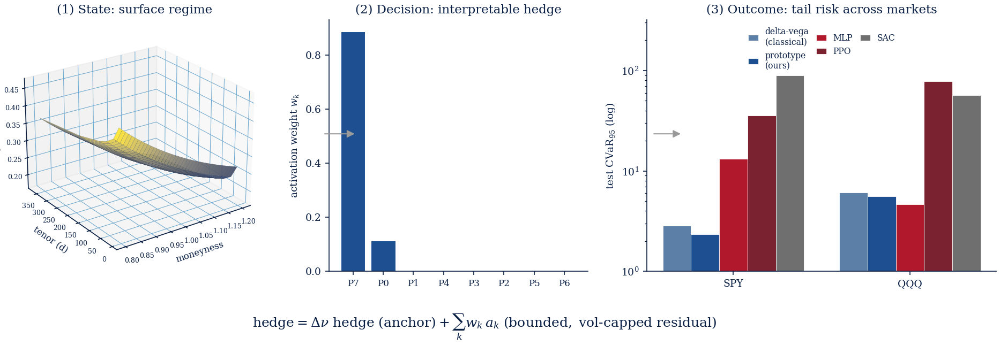
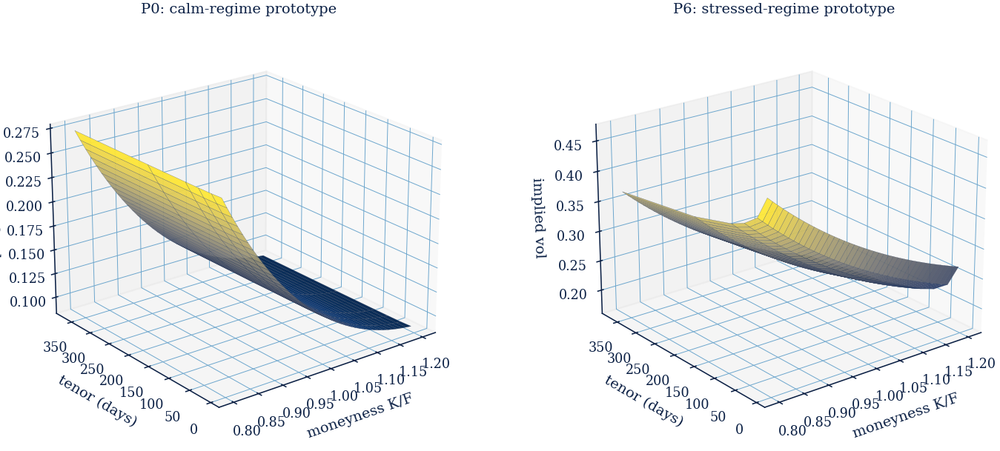
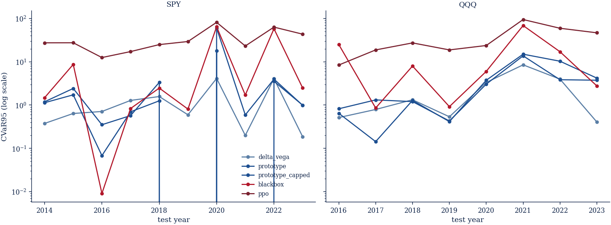
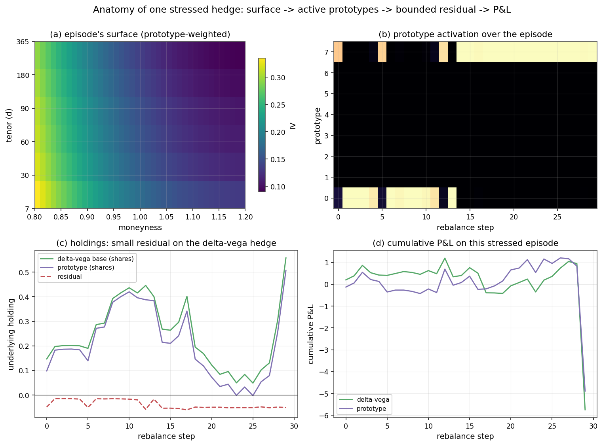

<div align="center">

# Interpretable Volatility-Surface Hedger

**A hedge you can trace back to the market conditions behind it.**

[](https://github.com/nl2992/ICAIF_interpretable-vol-surface-hedger/actions/workflows/ci.yml)
[](LICENSE)
[](environment.yml)

[Read the paper](paper/main.pdf) · [Explore the results](reports_real/) · [Run the study](#run-the-study) · [Research reference](docs/research-reference.md)

</div>

## The problem

A hedge has to hold up when markets change. Delta and delta–vega hedging give us
clear, familiar rules. Learned hedgers can use more of the market state, but their
decisions can be hard to explain, and a policy that looks good in training can
suffer large losses when the market moves into a different regime.

We ask a practical question: **can we use the shape of the implied-volatility
surface to manage tail risk, while making each hedge decision auditable?**

The surface describes how implied volatility changes across strikes and
maturities. Its level, skew, curvature and term structure give the model a richer
view of market conditions than spot or a single Greek alone.

## Our approach

We give the hedger a small vocabulary of representative market states, called
**prototypes**. It compares today's surface and context with those prototypes,
then blends their learned actions according to how closely they match.

In the real-data study, that blend is a **bounded adjustment to a delta–vega
hedge**. Each decision exposes the prototypes, their weights and the adjustment
they contribute. Training balances average P&L against tail losses, with
transaction costs included.

<p align="center">
  
</p>

*Read left to right: observe the surface, weight the matching prototypes, and
measure the resulting hedge's tail risk. This is the study's graphical abstract;
results below distinguish the experiment configurations.*

### What does a prototype look like?

A prototype represents a concrete surface rather than an unnamed hidden state.
The study's calm and stressed examples show the market patterns behind the
model's vocabulary.

<p align="center">
  
</p>

*Compare the level and shape of the two surfaces; their vertical scales differ.
The [prototype audit](reports_real/prototype_audit_report.md) provides the fuller catalogue.*

<details>
<summary><strong>Method details</strong>: state, training and baselines</summary>

- **State:** a moneyness–tenor surface and market/hedging context, standardised without look-ahead leakage.
- **Prototypes:** k-means medoids in standardised feature space, with bounded learned actions and a learned similarity temperature.
- **Decision:** a softmax-similarity-weighted blend of prototype actions; real-data policies use a delta–vega anchor.
- **Liability and instruments:** a short ATM option, hedged daily with the underlying and a longer-dated ATM option. Costs apply to building, rebalancing and liquidating positions.
- **Objective:** `E[P&L] − CVaR₉₅(loss)`, using the smooth Rockafellar–Uryasev formulation and L2 regularisation. The prototype and MLP use analytic gradients with L-BFGS-B and validation early stopping.
- **Comparisons:** unhedged, delta, delta–vega and a black-box MLP; the real-data analyses also include PPO/SAC deep-RL comparators.
- **Evaluation:** held-out synthetic paths and chronological real-data splits, followed by seed, ablation and walk-forward checks.

See the [full method and original study notes](docs/research-reference.md#method) and [paper source](paper/main.tex).

</details>

## What we found

**The real-data contribution is auditability and robustness, with tail risk
roughly on par with delta–vega.** The synthetic study shows stronger improvements;
the real-market evidence is more qualified.

Here, **CVaR₉₅ is the average loss in the worst 5% of outcomes**. Lower is better.

### Real options: SPY and QQQ

The study covers SPY (2010–2023) and QQQ (2012–2023), including major stress
periods. The tuned winner configuration reports the following five-seed results:

| Market | Prototype CVaR₉₅, mean ± std | Delta–vega CVaR₉₅ | Bootstrap p vs delta–vega |
| :--- | ---: | ---: | ---: |
| SPY | **2.34 ± 0.10** | 2.84 | 0.077 |
| QQQ | **5.61 ± 0.63** | 6.12 | 0.475 |

Source: [winner confirmation table](reports_real/tables/winner_confirmation.csv).
The differences favour the prototype directionally, but **do not establish
superiority at the 5% significance level**. The paper reports a combined
Stouffer p-value of 0.079.

The default SPY configuration is a separate experiment. Across seeds, its
prototype CVaR₉₅ is **2.36 ± 0.11**, compared with **6.61 ± 3.93** for the MLP
and **52.80 ± 14.59** for PPO. See the
[default multiseed table](reports_real/tables/multiseed_cvar.csv).
The [single-run comparison](reports_real/tables/model_comparison.csv) and
[original result tables](docs/research-reference.md) retain the P&L, CVaR₉₉,
drawdown, turnover and utility measurements.

### Where the approach struggles

Walk-forward testing asks a tougher question: train on prior years, then hedge
the next year. The prototype beats delta–vega in only **4 of 10 SPY years**.
In the COVID-2020 fold, the uncapped residual reaches CVaR₉₅ **59.98**;
a volatility-scaled cap reduces that to **17.96**, still above delta–vega's
**4.12**. A bounded action does not guarantee a low-risk outcome.

<p align="center">
  
</p>

*Follow each policy across years, especially the crisis folds. This figure uses a
logarithmic axis; consult the [stress-audit table](reports_real/tables/walkforward_stress_audit.csv)
for exact values, including non-positive values that a log axis cannot display.*

The first naive residual also underperformed on QQQ. A tail-weighted selection
objective restored the reported directional parity. Those failed experiments,
along with the surface-feature ablations, remain part of the
[research record](docs/research-reference.md#claims-and-evidence).
On the long SPY sample, the prototype mostly makes a conservative trim to
delta–vega; richer regime-specific actions appear in the synthetic study.

<details>
<summary><strong>Synthetic results</strong>: a controlled test of the idea</summary>

On disjoint held-out paths from the regime-switching stochastic-volatility and
jump simulator, the prototype reduces CVaR₉₅ by approximately 50% versus delta
and 35% versus delta–vega, and improves tail risk and turnover versus the MLP.
The original study reports significance under paired bootstrap and Wilcoxon tests.

| Policy | Mean P&L | CVaR₉₅ | CVaR₉₉ | Worst loss | Turnover | Utility |
| :--- | ---: | ---: | ---: | ---: | ---: | ---: |
| Unhedged | −0.40 | 13.21 | 18.19 | 23.49 | 0 | −13.61 |
| Delta | −0.15 | 2.79 | 4.22 | 5.12 | 299 | −2.93 |
| Delta–vega | −0.22 | 2.02 | 3.35 | 5.10 | 245 | −2.24 |
| Black-box MLP | +0.19 | 1.73 | 2.74 | 4.05 | 270 | −1.54 |
| **Prototype** | +0.03 | **1.30** | **1.76** | **2.24** | **175** | **−1.27** |

Higher utility is better. The simulator is jump-compensated with zero carry, so
policies cannot improve the objective simply by harvesting market drift.
See the [synthetic report](reports/final_report.md) and [ablations](reports/ablation_report.md).

</details>

## Follow one hedge

Interpretability should let us inspect a decision. This stressed episode connects
the surface to the active prototypes, then to the position adjustment and P&L.

<p align="center">
  
</p>

*Start at the top left and read clockwise through the decision: surface, active
prototypes, then P&L at bottom right. The bottom-left panel shows the small
residual behind the change in holdings. This is one illustrative episode;
aggregate performance is reported above.*

## Run the study

You can read the paper, reports, figures and CSV tables straight from this repo.
The synthetic experiment needs no external data.

```bash
git clone https://github.com/nl2992/ICAIF_interpretable-vol-surface-hedger.git
cd ICAIF_interpretable-vol-surface-hedger

python3 -m venv .venv
source .venv/bin/activate
python -m pip install -e ".[dev]"
python -m pytest

# Synthetic experiment, without ablations
make run-fast
```

For the full synthetic study, use `make run`. Python 3.11 is the tested
environment; the conda setup is in [environment.yml](environment.yml).
Generated outputs include the [comparison report](reports/final_report.md),
[prototype audit](reports/prototype_audit_report.md), figures and CSV tables.

<details>
<summary><strong>Real-data reproduction and paper build</strong></summary>

The real study uses OptionsDX option chains. Raw files are not committed
(approximately 3.8 GB); place them under `data/raw/spy/` and `data/raw/qqq/`.
See [DATA.md](DATA.md) for acquisition and layout, and the
[reproduction reference](docs/research-reference.md#reproduce-data--analysis--paper)
for the command-to-artifact mapping and seeds.

The real-data driver is `scripts/run_real_data.py`; follow the reference for
its data arguments. The synthetic quickstart does not reproduce the real-data
headline numbers. Set `OMP_NUM_THREADS=1` for run-to-run stability.

Build the paper with a TeX installation providing `acmart` and `latexmk`:

```bash
cd paper
latexmk -pdf main.tex
```

The [staged pipeline](docs/research-reference.md#staged-pipeline-matches-the-project-roadmap)
and [real-option loader example](docs/research-reference.md#using-real-option-data)
are available in the reference.

</details>

## Find your way around

| If you want to… | Start here |
| :--- | :--- |
| Read the study | [Paper PDF](paper/main.pdf) · [LaTeX source and build notes](paper/) |
| Check a reported number | [Real-data tables](reports_real/tables/) · [Claims and evidence](docs/research-reference.md#claims-and-evidence) |
| Inspect synthetic experiments | [Synthetic reports](reports/) |
| Understand data requirements | [Data guide](DATA.md) · [Schema checklist](docs/data_checklist.md) · [Sources](docs/data_sources.md) · [WRDS request](docs/wrds_data_request.md) |
| Explore the implementation | [Python package](src/ivsh/) · [Package map](docs/research-reference.md#repo-layout) |
| Reproduce or extend an experiment | [Scripts](scripts/) · [Configuration](configs/experiment.yaml) · [Makefile](Makefile) |
| Check the accounting and modelling tests | [Test suite](tests/) |
| Read the full original documentation | [Research reference](docs/research-reference.md) |

Released under the [MIT License](LICENSE). Citation metadata is in [CITATION.cff](CITATION.cff).
