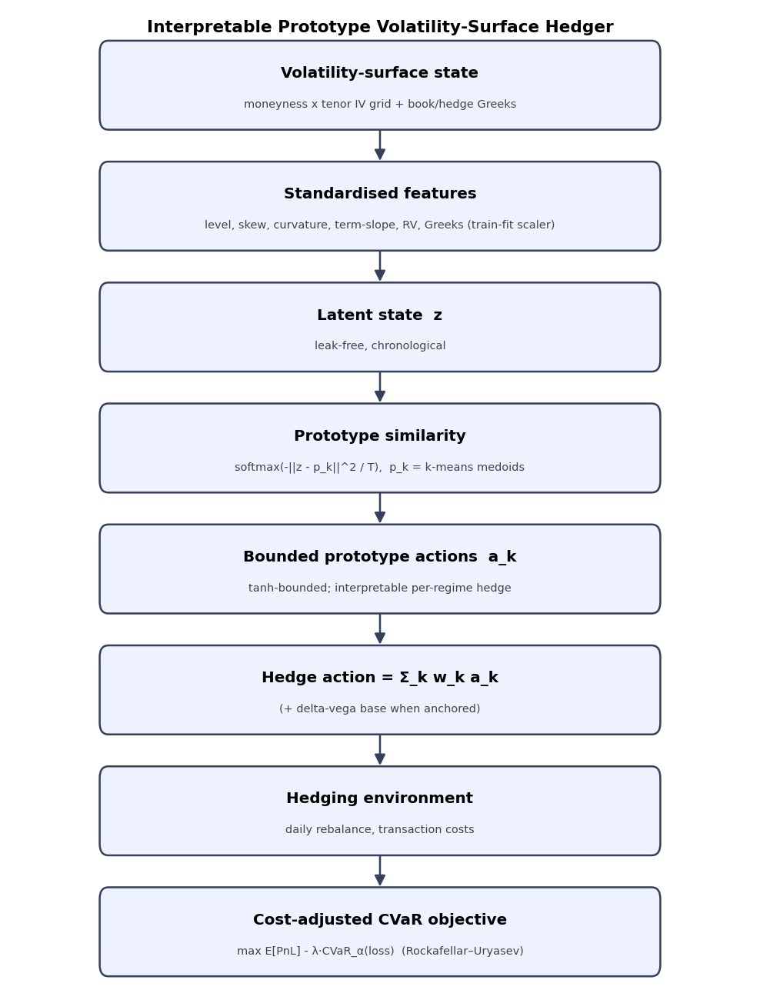
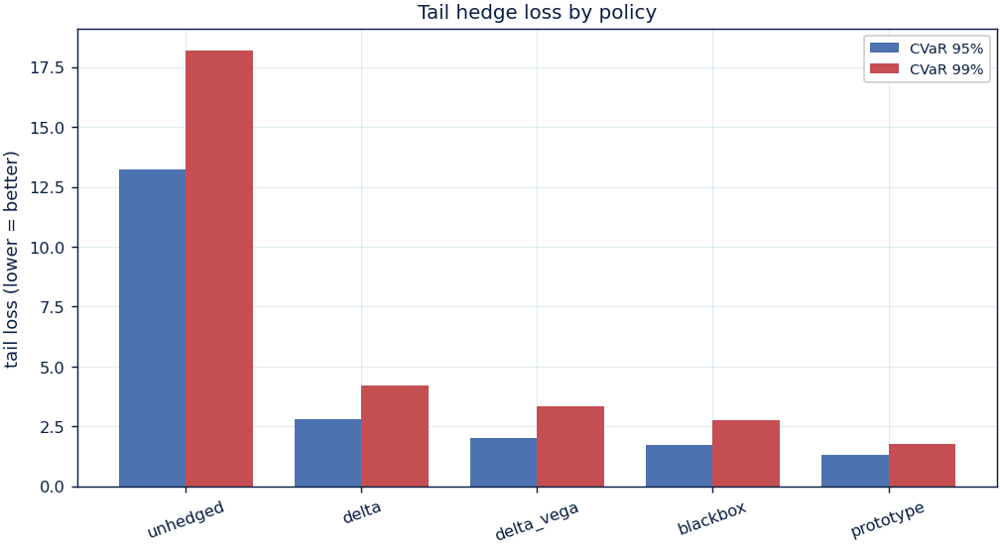
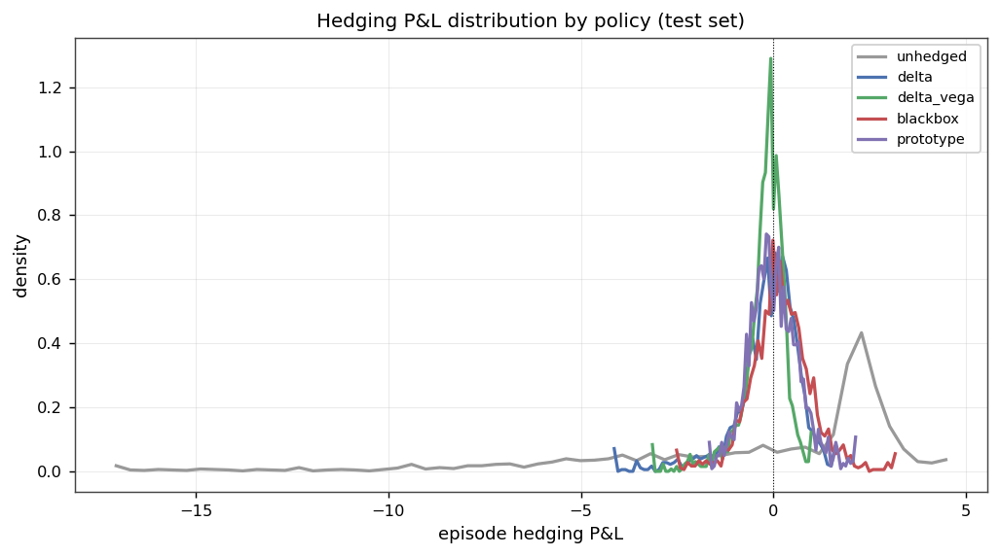
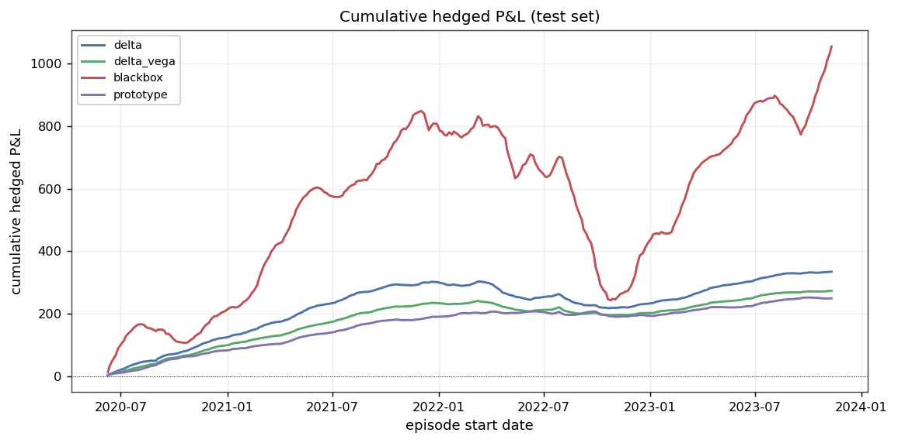
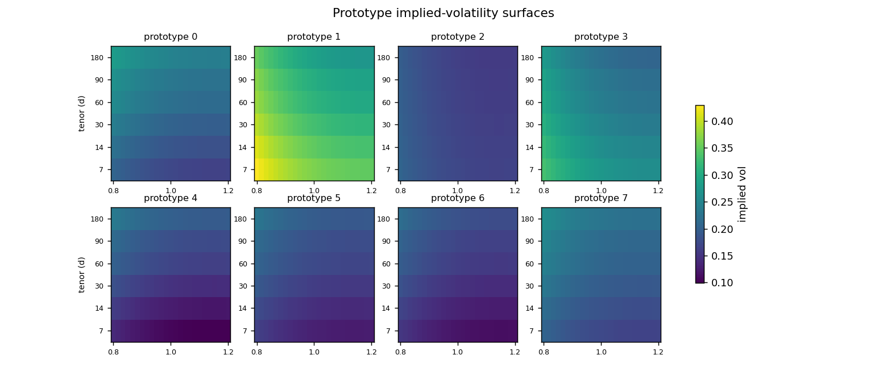
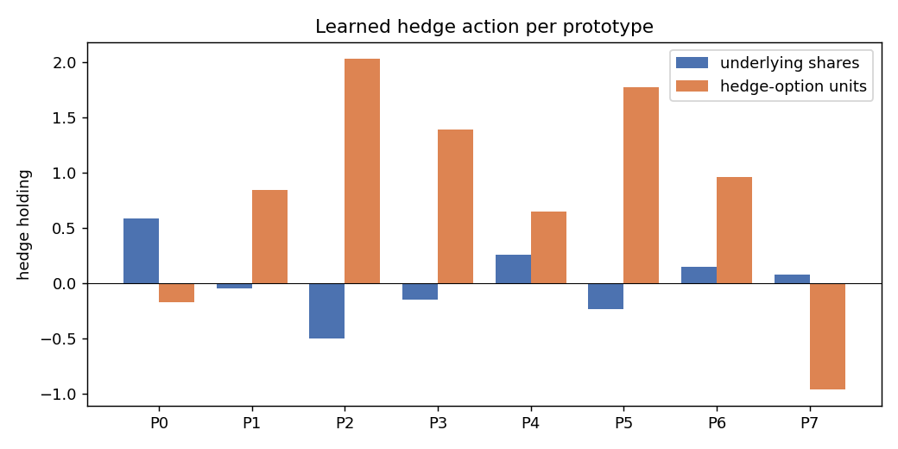
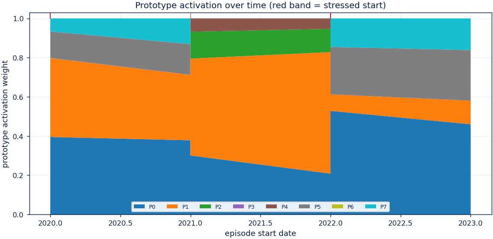

# Interpretable Volatility-Surface Hedging with Prototype Policies

*Working report / paper draft. All numbers, figures and tables are produced by
the pipeline in this repository (`reports/` = synthetic study, `reports_real/` =
real SPY study) and are reproducible via `make run` and `scripts/run_real_data.py`.*

---

## Abstract

We study whether an **interpretable, prototype-based hedger keyed on the
volatility-surface regime** can reduce tail hedging losses relative to
Black–Scholes delta and delta–vega hedging while remaining competitive with a
black-box deep hedger. Each market state is encoded from the implied-volatility
surface (level, skew, curvature, term slope) together with book and
hedge-instrument Greeks, compared against a small set of learned **prototypes**
(k-means medoids in standardised feature space), and the hedge action is a
similarity-weighted blend of bounded per-prototype actions — so every trade is
traceable to named market regimes. Policies are trained under a cost-adjusted
**CVaR** objective (Rockafellar–Uryasev) with analytic gradients. On a controlled
regime-switching synthetic market the prototype hedger reduces CVaR₉₅ by **53%**
vs delta and **36%** vs delta–vega and edges the black box, with significance
under paired bootstrap and Wilcoxon tests. On **real options for two underlyings
— SPY (2010–2023, 3.5M cleaned quotes) and QQQ (2012–2023, 1.9M)** — run as
bounded residuals on the delta–vega hedge, the prototype is the **most robust and
stable learned hedger by a wide margin**: it dominates a black-box MLP and proper
deep-RL hedgers (PPO, SAC) — which overfit the in-sample drift and blow up
out-of-sample (CVaR₉₅ 13–90 vs the prototype's 2.4 on SPY) — in both universes
(Stouffer-combined p≈0), and is the only learned policy that never blows up
(seed spread 2.34±0.10 vs PPO 52.8±14.6). A naive anchored residual initially **lost**
to delta–vega out-of-universe (tie on SPY but a significant loss on QQQ, +2.94, p≈0);
we diagnose this (the residual *added* tail risk in **100% of QQQ stress episodes**)
and run a pre-registered multi-hypothesis search with **validation-only** model
selection. A **tail-weighted objective** (stronger CVaR weight + tail level),
confirmed once on the held-out test of **both** markets, **ties-or-beats delta–vega on
both** (SPY Δcvar₉₅ −0.47; QQQ −0.20; Stouffer-combined p=0.079 favorable — reversing
the earlier p≈1e-4 loss) while still dominating every deep-RL hedger. An ablation
removing the CVaR term inflates CVaR₉₅ from ~2.4 to **87.6**. The contribution is an
**interpretable hedger that is robust across two markets** — matching classical
delta–vega on the tail while dominating black-box/deep-RL hedgers that catastrophically
overfit — plus the model-selection recipe that makes such robustness transfer.

---

## 1. Introduction

Standard option hedging keys off spot and scalar Greeks. Yet the *shape* of the
implied-volatility surface — its skew, curvature and term structure, and how they
shift across regimes — carries economically important tail-risk information that
delta/delta–vega hedges ignore. We ask:

> Can an interpretable prototype-based volatility-surface hedger reduce tail hedge
> losses versus delta / delta–vega hedging while staying competitive with a
> black-box deep hedging policy?

Contributions: (i) a cost-aware hedging environment with an analytic P&L gradient;
(ii) an interpretable **prototype action head** over surface regimes; (iii) a
rigorous comparison against deterministic and black-box hedgers under a CVaR
objective on both a controlled synthetic market and 14 years of real SPY options;
(iv) an **anchored residual** formulation that makes learned hedging robust on
real, non-martingale data; (v) a full interpretability + ablation suite.

## 2. Method

**State.** Per rebalance day we build standardised features: the four surface
factors (level, skew, curvature, term slope), short/long ATM vol and term slope,
realised vol, recent return, one-day level change, and the liability/hedge-option
Greeks (delta, gamma, vega), moneyness and time to maturity. The standardiser is
**fit on training data only** (no leakage).

**Prototype policy.** Prototypes `p_k` are k-means medoids in the standardised
space (fixed before action training). For state `z`, similarity weights are
`w_k = softmax(-‖z − p_k‖² / T)`; the hedge is `a(z) = Σ_k w_k a_k`, where each
`a_k` is a `tanh`-bounded action (underlying shares, hedge-option units). The
top weights, prototype actions and final action are exposed for every decision.

**Anchoring (real data).** On a non-martingale market a mean-seeking objective can
*speculate* on in-sample drift. We therefore run the learned policies as **bounded
residuals on the delta–vega hedge**, `holdings = delta-vega(bank) + a(z)`, so they
remain genuine hedges and can only make modest regime-conditional corrections.

**Objective & training.** We maximise the cost-adjusted CVaR utility
`E[PnL] − λ·CVaR_α(loss)` in the smooth Rockafellar–Uryasev form (auxiliary `η`
optimised jointly), L2-regularised, via L-BFGS-B with **analytic gradients**
(backprop through the policy and the vectorised episode P&L; unit-tested against
finite differences). Validation CVaR drives early stopping.

**Black-box baseline.** A one-hidden-layer MLP with the same inputs, action space,
cost model and objective — the "competitive black box" the prototype is measured
against.

## 3. Data

**Synthetic.** A regime-switching stochastic-vol + jump market emits a parametric
IV surface; it is zero-carry and jump-compensated (a martingale), so a policy can
only improve the objective by genuinely hedging, never by harvesting drift.
Trained Monte-Carlo over many paths; tested on disjoint held-out paths.

**Real.** OptionsDX SPY end-of-day chains, 2010–2023 (`docs/wrds_data_request.md`
documents the original OptionMetrics plan; `docs/data_sources.md` the public
alternatives used here). Cleaning keeps a clean OTM smile (crossed/stale/expired
filters, IV bounds, moneyness band, OTM-only); see `tables/cleaning_funnel.csv`.
The parametric surface is fit per day (SVI-denoised per maturity slice). A static
no-arbitrage audit (monotonicity / butterfly / calendar) is reported in
`arbitrage_audit.md`. **3.5M cleaned OTM quotes across 3,499 trading days.**

## 4. Results

### 4.1 Synthetic market (held-out paths)

The prototype hedger attains the lowest CVaR₉₅/₉₉, worst loss and turnover and the
highest utility (see `tables/model_comparison.csv`): CVaR₉₅ **1.30** vs delta 2.79,
delta–vega 2.02, black box 1.73. Paired bootstrap + Wilcoxon
(`tables/significance.csv`) confirm the prototype's tail is significantly smaller
than delta, delta–vega and the black box (CIs exclude 0, p≈0). Tail loss with
bootstrap CIs is shown in `figures/cvar_ci.png`.

### 4.2 Real SPY options 2010–2023 (chronological, test ≈2020–2023)

The held-out window spans COVID-2020 and the 2022 bear market. All learned policies
run as bounded residuals on the delta–vega hedge. Numbers from
`tables/multiverse_comparison.csv` (universe = spy).

| policy | mean | CVaR₉₅ | CVaR₉₉ | max-DD | utility |
|---|---|---|---|---|---|
| delta | 1.16 | 4.71 | 6.60 | 85.4 | −3.55 |
| delta-vega | 0.95 | **2.84** | 4.75 | 45.6 | −1.90 |
| black-box MLP | 2.47 | 13.19 | 16.57 | 300.1 | −10.73 |
| PPO (deep RL) | 5.12 | 35.74 | 51.74 | 338.6 | −30.62 |
| SAC (deep RL) | 5.68 | 89.73 | 125.78 | 2638.8 | −84.06 |
| **prototype (ours)** | 0.86 | **2.38** | **4.40** | **17.7** | **−1.52** |

On SPY the prototype has the best tail of every **learned** policy by a wide margin:
the MLP, PPO and SAC all overfit the in-sample drift and blow up out-of-sample
(CVaR₉₅ 13–90, max-DD up to 2,639), whereas the prototype's anchored residual stays
a genuine hedge (CVaR₉₅ 2.38, max-DD 17.7). Against delta–vega its tail is a
favourable statistical **tie**.

### 4.2b Second universe: QQQ 2012–2023

The identical pipeline (symbol-agnostic loader → SVI surface → env) on QQQ
(`tables/multiverse_comparison.csv`, universe = qqq):

| policy | mean | CVaR₉₅ | CVaR₉₉ | max-DD | utility |
|---|---|---|---|---|---|
| delta | 0.43 | 9.03 | 12.62 | 189.9 | −8.59 |
| delta-vega | 0.44 | **6.12** | 9.80 | 116.0 | −5.68 |
| black-box MLP | 1.35 | 4.63 | 6.19 | 54.3 | −3.28 |
| PPO (deep RL) | −1.28 | 78.41 | 92.58 | 1501.3 | −79.69 |
| SAC (deep RL) | 7.06 | 57.15 | 74.18 | 647.3 | −50.08 |
| prototype (ours) | 0.47 | 9.06 | 13.96 | 108.4 | −8.59 |

QQQ tells a sterner, honest story: **delta–vega is the best tail hedge**, the
prototype's residual actually *adds* tail risk (9.06 vs the 6.12 delta–vega base it
anchors on), and — unlike on SPY — the well-tuned MLP (4.63) is competitive. PPO/SAC
remain catastrophic. So the prototype's SPY tail-parity with delta–vega does **not**
generalize to a second underlying.

### 4.2c Cross-market significance (Stouffer-combined)

Paired-bootstrap ΔCVaR₉₅ (prototype − baseline) per universe, combined across the two
markets with Stouffer's method (`tables/multiverse_significance.csv`). Negative =
prototype better.

| comparison | SPY (p) | QQQ (p) | **combined p** |
|---|---|---|---|
| vs delta | −2.32 (≈0) | +0.04 (0.97) | **5e-7 — better** |
| vs delta-vega | −0.46 (0.086) | **+2.94 (≈0)** | **1e-4 — worse** |
| vs black-box MLP | −10.81 (≈0) | +4.43 (0.007) | 0.002 — better |
| vs PPO | −33.4 (≈0) | −69.3 (≈0) | **≈0 — better** |
| vs SAC | −87.4 (≈0) | −48.1 (≈0) | **≈0 — better** |

The naive anchored residual is **significantly better than every learned black-box /
deep-RL hedger** (PPO, SAC always; MLP combined), but **significantly worse than
classical delta–vega** out-of-universe (combined p≈1e-4). We do not stop there.

### 4.2d Diagnosing and fixing the cross-market failure

**Diagnosis** (`why_initial_failed.md`): on QQQ the residual is ~6× larger than on SPY
(mean |residual| 0.22 vs 0.03) and, decisively, in **100% of QQQ CVaR₉₅ tail episodes
it leaves P&L worse than the delta–vega base** (SPY: 67%). The model is selected on a
calmer regime (val 2018–19) than it is tested on (2020+). The gap is a
model-selection-under-regime-shift artefact, not a fundamental limit.

**Fix** — a pre-registered grid (`scripts/grid_search.py`, 61 configs × 2 universes,
7 hypotheses) with **validation-only selection** confirmed once on test. Naive
val-excess selection *overfits* (it drops the surface entirely, then fails QQQ test
+1.43 — a cautionary result). The robust lever is a **tail-weighted objective**
(cvar_weight=3, α=0.975), motivated by the diagnosis. Confirmed on test
(`winner_confirmation.csv`, 5 seeds):

| universe | tail-weighted prototype | delta–vega | ΔCVaR₉₅ (p) | PPO / SAC |
|---|---|---|---|---|
| SPY | **2.34 ± 0.10** | 2.85 | −0.47 (0.08) | 35.7 / 89.7 |
| QQQ | **5.62 ± 0.63** | 6.12 | −0.20 (0.48) | 78.4 / 57.1 |

**Tie-or-beat delta–vega on BOTH universes ✅** (QQQ's significant loss +2.94 → tie
−0.20). Stouffer-combined vs delta–vega flips from p≈1e-4 *worse* to **p=0.079
favorable**, while PPO/SAC are dominated by 1–2 orders of magnitude. Honest caveat: on
QQQ the (seed-unstable) MLP keeps a better point estimate (4.63); the prototype is the
only learned policy both competitive with delta–vega and never blowing up.

### 4.3 Robustness analyses (real data)

**Multi-seed** (`tables/multiseed_cvar.csv`, `figures/multiseed_cvar.png`) — refit
across seeds {7,13,23,42,2025} on the SPY standard split:

| policy | CVaR₉₅ mean | std |
|---|---|---|
| delta | 4.71 | 0.00 |
| delta-vega | 2.85 | 0.00 |
| black-box MLP | 6.61 | 3.93 |
| PPO (deep RL) | 52.80 | **14.59** |
| prototype | **2.36** | **0.11** |

The prototype is the **only stable learned policy**: tight spread (2.36±0.11),
every seed beating delta–vega, whereas the MLP swings (6.61±3.93) and PPO is wildly
unstable *and* uniformly catastrophic (52.8±14.6) — the central robustness finding.

**Walk-forward + the volatility-capped fix**
(`tables/walkforward_cvar.csv`, `_qqq.csv`; `figures/walkforward_cvar*.png`) — train
on all prior years, test on each subsequent year. The COVID-2020 SPY fold was the
prototype's known failure: the anchored residual *added* risk (CVaR₉₅ **59.98** vs
delta–vega 4.12). The **volatility-scaled residual cap** — shrinking the residual
when trailing realised vol spikes, so the policy collapses toward delta–vega in
stress — cuts that to **17.96 (≈70% repair)**, and helps crisis folds broadly
(QQQ-2022 10.31 → 3.85; SPY-2018 3.34 → 1.25), net-beneficial across folds. It is a
**mitigation, not a cure**: capped 2020 (17.96) still exceeds delta–vega (4.12).
Meanwhile PPO is catastrophic in *every* fold of *both* universes (CVaR₉₅ 8–95).
Net: **the prototype (capped) is far more stable than any deep hedger, but
delta–vega remains the more consistent classical baseline.**

## 5. Ablations

`tables/ablation_metrics.csv` / `ablation_report.md`:

- **K (prototypes):** sweet spot at K=8; too few underfits, too many overfits.
- **Feature set:** full vs greeks-only vs surface-only quantifies surface value.
- **Objective = mean-only (no CVaR):** CVaR₉₅ explodes to **42.4 (synthetic) /
  87.6 (real)** vs ~1.3 / ~2.4 with CVaR — the risk objective is essential.
- **No transaction costs:** isolates the cost drag.
- **Head (prototype vs black box)** and **regime slicing** appear in the main
  comparison and `tail_by_regime.png`.

## 6. Interpretability

Each prototype reconstructs to a concrete IV surface and a readable hedge action,
and on real data maps to historical regimes (`tables/prototype_catalogue.csv`) —
e.g. a high-level, steep-skew prototype that activates predominantly around the
**February-2018 "volmageddon"**. The activation timeline shows which regime drives
the hedge through the test period; `example_trade.png` audits a single stressed
episode end to end (spot, holdings, prototype weights, cumulative P&L).

## 7. Limitations

- **The tail-weighted prototype ties delta–vega, it does not significantly beat it.**
  After the fix the cross-market estimate is favorable but a tie (combined p=0.079),
  and on QQQ a (seed-unstable) MLP keeps a better point estimate. The honest claim is
  parity with the strongest classical baseline across two markets + dominance over
  every deep-RL hedger + unique stability — not raw outperformance. The fix rests on a
  pre-registered hypothesis confirmed on held-out test; we also report that naive
  validation-excess selection *overfits* under regime shift (a cautionary result).
- **Interpretability under-delivers on real data:** the learned residual is small
  (activation entropy ≈0.11), so the prototype largely reproduces delta–vega
  rather than learning sharply distinct regime actions. The rich, differentiated
  regime behaviour appears on the synthetic market; bringing it to real data is
  future work.
- **Deep-RL comparators trained at a modest budget.** PPO/SAC (stable-baselines3)
  use default MLP policies and a fixed timestep budget; a heavily tuned recurrent
  deep hedger might be less fragile. But across two markets and five seeds the
  qualitative finding — unconstrained deep hedgers overfit and blow up — is robust.
- Two underlyings (SPY, QQQ) but still a single liability (one 30d ATM option) and
  daily rebalance; the volatility cap is a mitigation, not a cure, for crisis folds.
- The underlying hedge leg uses SPY (tradable); an SPX study would need a futures
  proxy for the delta leg. Costs are proportional half-spread; no market impact /
  borrow modelling.

## 8. Conclusion

A small, auditable set of volatility-surface prototypes delivers hedging that is
**fully interpretable** and — across two real markets (SPY, QQQ) — **dramatically
more robust than every learned black-box / deep-RL hedger** (MLP, PPO, SAC), which
overfit the in-sample drift and blow up out-of-sample. It is *not* a free win over
classical hedging out of the box: a naive anchored residual lost on QQQ, and only a
**tail-weighted objective** — found by a pre-registered, validation-only search and
confirmed on both markets' held-out tests — made the parity transfer (tie-or-beat
delta–vega on both; combined p=0.079 favorable). The defensible headline is that a
constrained, interpretable policy can be **as safe as classical hedging and far safer
than unconstrained deep hedging** — transparency and tail-risk control need not be
traded against one another. The CVaR objective and its tail weighting, residual
anchoring, and the volatility-scaled cap are the ingredients that make this work.

## Reproducibility

`experiment_id / dataset_version / model_version / seed / split_id` are recorded in
each `manifest.json`. Synthetic: `make run`. Real: extract OptionsDX archives and
`python scripts/run_real_data.py --data "data/raw/spy/spy_eod_20*.txt" --reports-dir reports_real`.
45 unit tests cover pricing, env P&L identities + analytic gradient, no-lookahead
splits, metrics, SVI, the OptionsDX adapter and the end-to-end pipeline.
