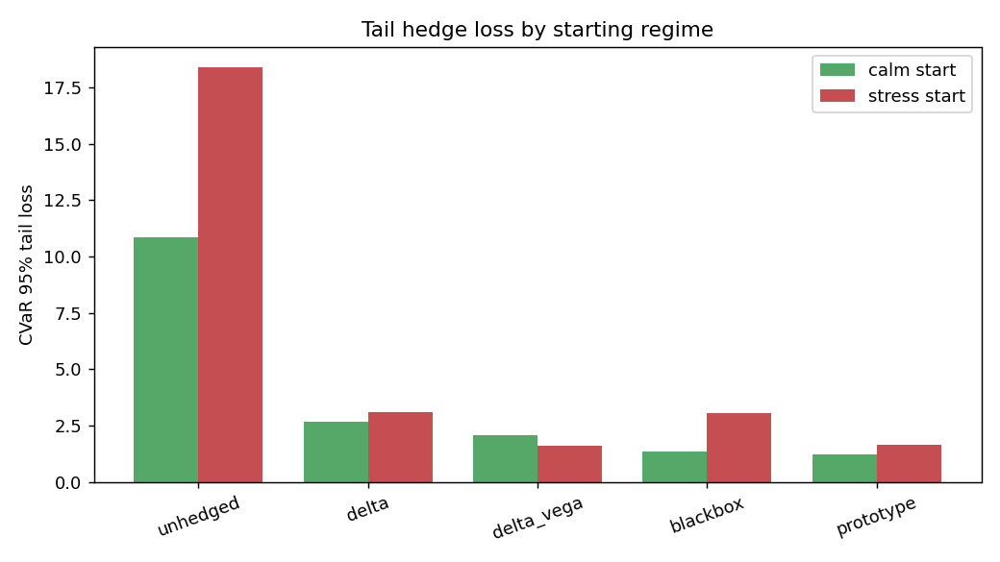

# Final Report — Interpretable Volatility-Surface Hedger

**Experiment:** `ivsh_demo`  |  dataset `synthetic-regime-sv-jump-v1`  |  model `proto-surface-hedger-v1`  |  seed `7`  |  split `train24-val6-test12`

## Research question
> Can an interpretable prototype-based volatility-surface hedger reduce tail hedge losses versus delta / delta-vega hedging while staying competitive with a black-box deep hedging policy?

## Setup
- Liability: short 1.0 ATM call(s), 30-day tenor, hedged daily to expiry.
- Hedge instruments: underlying + 60-day ATM option.
- Costs: 1.0 bps underlying, 30.0 bps option (on traded notional).
- Market: synthetic regime-switching stochastic-vol + jumps, zero carry (martingale). Trained on 3768 episodes, tested on 1884 held-out episodes.
- Objective: maximise E[P&L] − CVaR₉₅(loss) (Rockafellar–Uryasev), L2-regularised.

## Model comparison (test set)

| method | mean_pnl | median_pnl | std_pnl | var_95 | cvar_95 | cvar_99 | worst | max_drawdown | turnover | utility |
| --- | --- | --- | --- | --- | --- | --- | --- | --- | --- | --- |
| unhedged | -0.3963 | 1.69 | 4.261 | 9.197 | 13.21 | 18.19 | 23.49 | 1129 | 0 | -13.61 |
| delta | -0.1454 | -0.0147 | 0.8786 | 1.759 | 2.785 | 4.219 | 5.115 | 291.4 | 299.3 | -2.931 |
| delta_vega | -0.2197 | -0.1276 | 0.5981 | 1.234 | 2.021 | 3.349 | 5.103 | 415.7 | 245.2 | -2.24 |
| blackbox | 0.1895 | 0.1671 | 0.8598 | 1.044 | 1.734 | 2.739 | 4.049 | 36.69 | 269.9 | -1.544 |
| prototype | 0.028 | -0.029 | 0.6791 | 0.9848 | 1.298 | 1.759 | 2.241 | 54.19 | 174.6 | -1.27 |

Lower CVaR / worst / max-drawdown is better; higher utility is better.

## Tail loss by regime

| method | calm_cvar95 | stress_cvar95 |
| --- | --- | --- |
| unhedged | 10.87 | 18.39 |
| delta | 2.667 | 3.105 |
| delta_vega | 2.075 | 1.609 |
| blackbox | 1.341 | 3.04 |
| prototype | 1.232 | 1.657 |

## Statistical significance (prototype vs baselines)

| comparison | Δcvar95 | cvar95 CI | boot p | wilcoxon p |
| --- | --- | --- | --- | --- |
| prototype − delta | -1.488 | [-1.744, -1.232] | 0 | 0 |
| prototype − delta_vega | -0.7226 | [-0.941, -0.490] | 0 | 0 |
| prototype − blackbox | -0.436 | [-0.615, -0.253] | 0 | 0 |

A negative Δcvar95 with a CI excluding 0 means the prototype hedger has a *significantly smaller* tail loss than the comparator.

## Headline finding
The prototype surface hedger cuts CVaR₉₅ tail loss by **53%** versus delta and **36%** versus delta-vega, while landing below the black-box deep hedger (prototype 1.298 vs black-box 1.734) — with a fully auditable, prototype-based decision trail.

See [prototype_audit_report.md](prototype_audit_report.md) for interpretability, [ablation_report.md](ablation_report.md) for ablations, and [arbitrage_audit.md](arbitrage_audit.md) for the static no-arbitrage surface audit.
