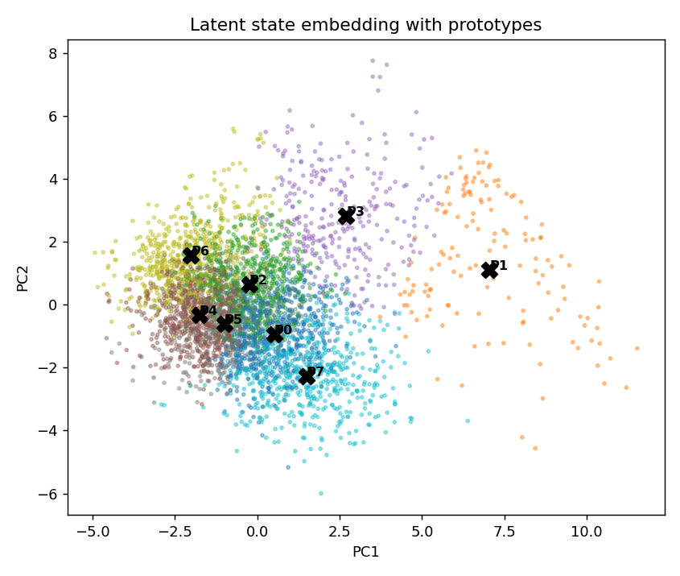
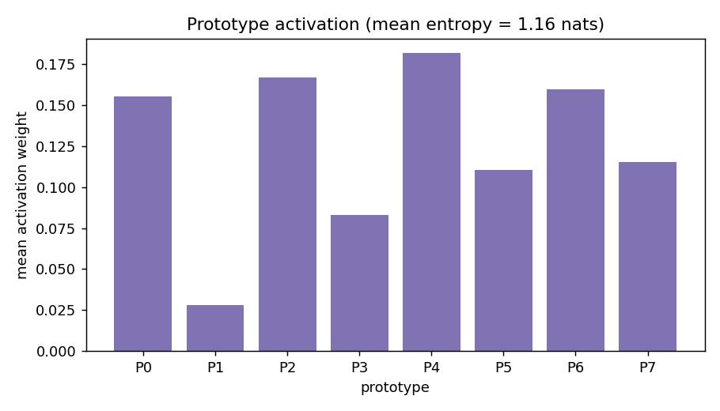
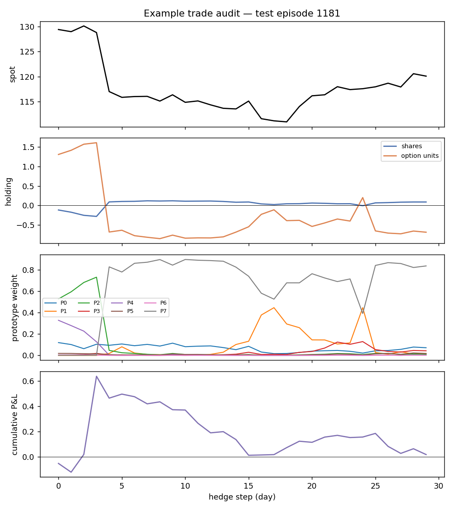

# Prototype Audit Report

Every hedge action is a similarity-weighted blend of a small set of learned volatility-surface prototypes, so each decision is traceable to named market regimes.

## Prototype catalogue

| prototype | n_assigned | share_pct | frac_stress | iv_level | skew | curvature | term_slope | action_shares | action_option |
| --- | --- | --- | --- | --- | --- | --- | --- | --- | --- |
| P0 | 1.785e+04 | 15.8 | 0.06 | 0.205 | -0.09 | 0.315 | 0.023 | 0.584 | -0.17 |
| P1 | 4064 | 3.6 | 0.83 | 0.33 | -0.177 | 0.506 | -0.023 | -0.051 | 0.847 |
| P2 | 1.796e+04 | 15.9 | 0.07 | 0.167 | -0.084 | 0.327 | -0.003 | -0.501 | 2.036 |
| P3 | 8320 | 7.4 | 0.57 | 0.251 | -0.156 | 0.446 | -0.016 | -0.148 | 1.391 |
| P4 | 1.973e+04 | 17.5 | 0.02 | 0.148 | -0.084 | 0.303 | 0.029 | 0.256 | 0.647 |
| P5 | 1.027e+04 | 9.1 | 0.03 | 0.16 | -0.08 | 0.307 | 0.02 | -0.235 | 1.777 |
| P6 | 1.799e+04 | 15.9 | 0.07 | 0.147 | -0.088 | 0.313 | 0.02 | 0.151 | 0.959 |
| P7 | 1.685e+04 | 14.9 | 0.06 | 0.197 | -0.085 | 0.311 | 0.017 | 0.076 | -0.959 |

`iv_level / skew / curvature / term_slope` are the prototype's volatility-surface factors; `action_shares / action_option` are its learned hedge holdings.

Mean prototype-activation entropy: **1.16 nats** (0 = always one prototype, ln(K) = uniform).

## Example trade audit

Test episode 1181 (a stressed path where the naive delta hedge suffers a large loss). The panels show the spot path, the prototype hedge holdings, the prototype activation weights through time, and the cumulative hedged P&L.

Dominant prototype along this path: 7.
