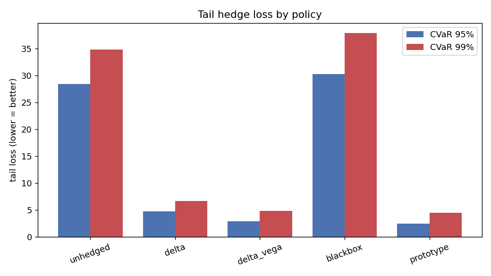
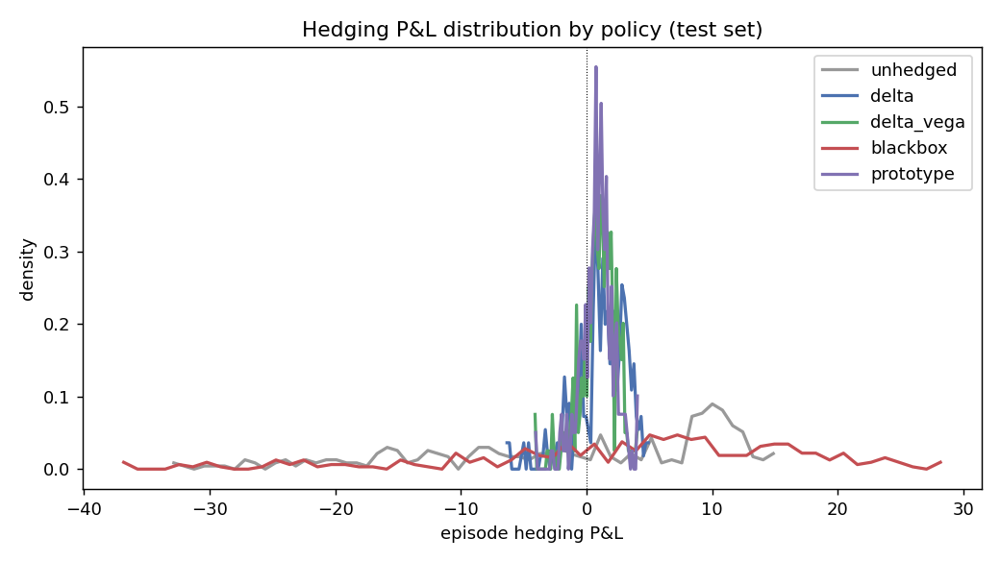
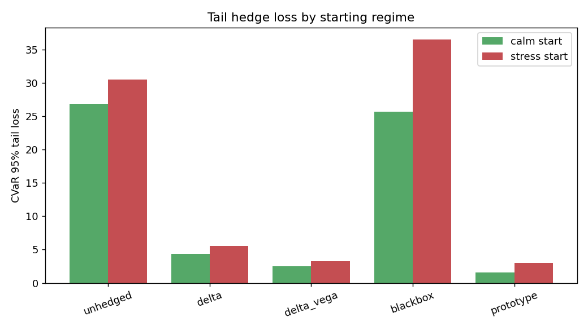

# Final Report — Interpretable Volatility-Surface Hedger

**Experiment:** `spy_2010_2023`  |  dataset `synthetic-regime-sv-jump-v1`  |  model `proto-surface-hedger-v1`  |  seed `7`  |  split `train24-val6-test12`

## Research question
> Can an interpretable prototype-based volatility-surface hedger reduce tail hedge losses versus delta / delta-vega hedging while staying competitive with a black-box deep hedging policy?

## Setup
- Liability: short 1.0 ATM call(s), 30-day tenor, hedged daily to expiry.
- Hedge instruments: underlying + 60-day ATM option.
- Costs: 1.0 bps underlying, 30.0 bps option (on traded notional).
- Market: real option panel (2010-01-04 to 2023-12-29), per-day surface fit, chronological split. Trained on 683 episodes, tested on 289 held-out episodes.
- Objective: maximise E[P&L] − CVaR₉₅(loss) (Rockafellar–Uryasev), L2-regularised. Learned policies are **bounded residuals on the delta-vega hedge** (anchored), so they stay genuine hedges on non-martingale real data.

## Model comparison (test set)

| method | mean_pnl | median_pnl | std_pnl | var_95 | cvar_95 | cvar_99 | worst | max_drawdown | turnover | utility |
| --- | --- | --- | --- | --- | --- | --- | --- | --- | --- | --- |
| unhedged | -0.926 | 1.492 | 12.25 | 23.83 | 28.36 | 34.8 | 38.24 | 449 | 0 | -29.28 |
| delta | 1.157 | 1.354 | 2.158 | 2.941 | 4.708 | 6.598 | 7.011 | 85.35 | 1100 | -3.55 |
| delta_vega | 0.9464 | 1.11 | 1.456 | 1.662 | 2.845 | 4.747 | 5.921 | 45.64 | 878.6 | -1.899 |
| blackbox | 3.647 | 5.903 | 13.46 | 24.2 | 30.23 | 37.86 | 38.93 | 604.8 | 5054 | -26.58 |
| prototype | 0.8627 | 0.9507 | 1.298 | 1.288 | 2.383 | 4.397 | 5.237 | 17.7 | 927.9 | -1.52 |

Lower CVaR / worst / max-drawdown is better; higher utility is better.

## Tail loss by regime

| method | calm_cvar95 | stress_cvar95 |
| --- | --- | --- |
| unhedged | 26.84 | 30.5 |
| delta | 4.34 | 5.548 |
| delta_vega | 2.486 | 3.276 |
| blackbox | 25.62 | 36.47 |
| prototype | 1.56 | 3.03 |

## Statistical significance (prototype vs baselines)

| comparison | Δcvar95 | cvar95 CI | boot p | wilcoxon p |
| --- | --- | --- | --- | --- |
| prototype − delta | -2.325 | [-3.252, -1.286] | 0 | 0 |
| prototype − delta_vega | -0.4623 | [-0.927, 0.076] | 0.086 | 0.0002 |
| prototype − blackbox | -27.84 | [-31.410, -23.683] | 0 | 0 |

A negative Δcvar95 with a CI excluding 0 means the prototype hedger has a *significantly smaller* tail loss than the comparator.

## Headline finding
The prototype surface hedger cuts CVaR₉₅ tail loss by **49%** versus delta and **16%** versus delta-vega, while landing below the black-box deep hedger (prototype 2.383 vs black-box 30.226) — with a fully auditable, prototype-based decision trail.

See [prototype_audit_report.md](prototype_audit_report.md) for interpretability, [ablation_report.md](ablation_report.md) for ablations, and [arbitrage_audit.md](arbitrage_audit.md) for the static no-arbitrage surface audit.
