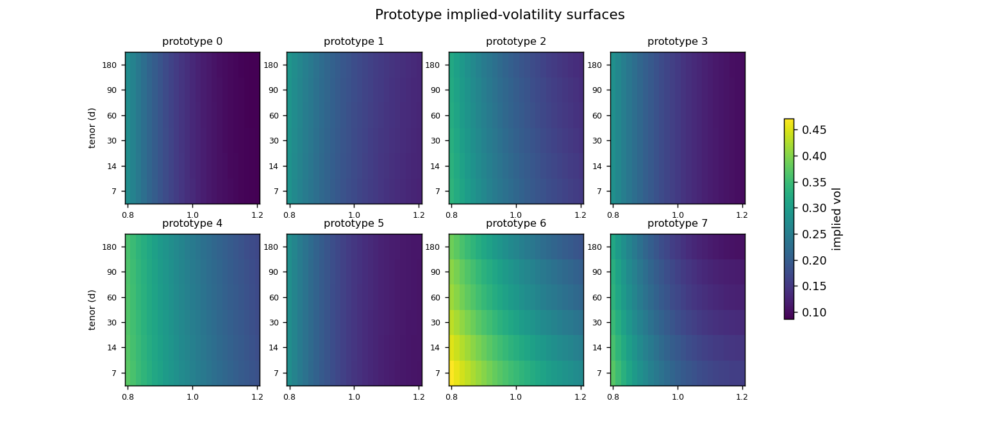
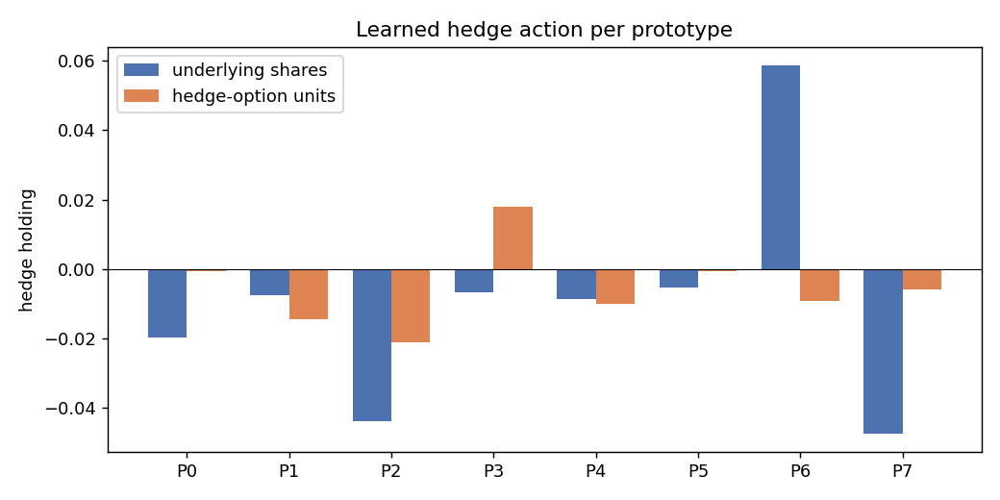
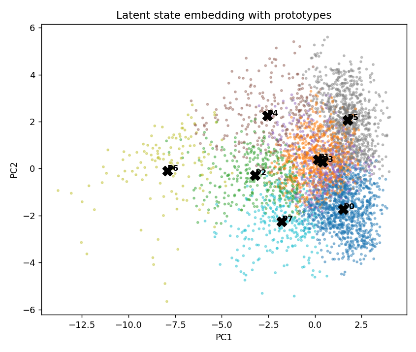
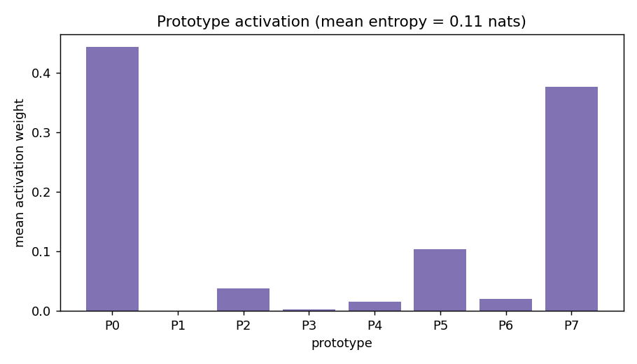
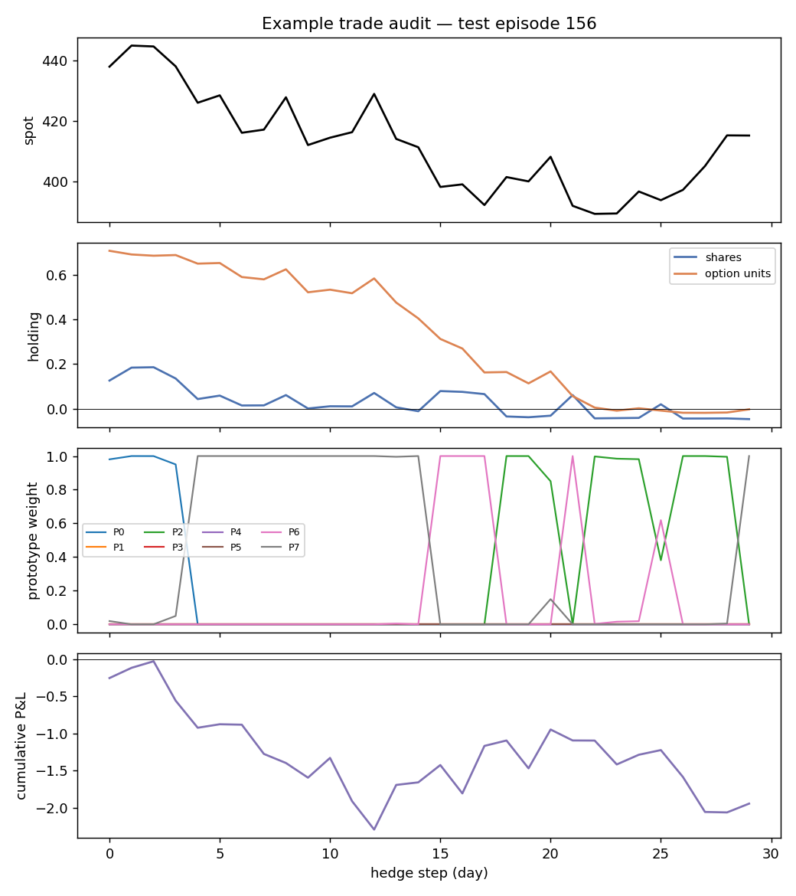

# Prototype Audit Report

Every hedge action is a similarity-weighted blend of a small set of learned volatility-surface prototypes, so each decision is traceable to named market regimes.

## Prototype catalogue

| prototype | n_assigned | share_pct | frac_stress | iv_level | skew | curvature | term_slope | action_shares | action_option | example_date | top_period | n_dates |
| --- | --- | --- | --- | --- | --- | --- | --- | --- | --- | --- | --- | --- |
| P0 | 5379 | 26.3 | 0.07 | 0.131 | -0.421 | 0.993 | -0 | -0.02 | -0.001 | 2015-06-19 | 2017-06 | 5379 |
| P1 | 3819 | 18.6 | 0.03 | 0.175 | -0.365 | 0.56 | 0.002 | -0.008 | -0.014 | 2010-12-21 | 2012-03 | 3819 |
| P2 | 1624 | 7.9 | 0.16 | 0.206 | -0.435 | 0.514 | -0.006 | -0.044 | -0.021 | 2011-06-28 | 2011-06 | 1624 |
| P3 | 2284 | 11.1 | 0.05 | 0.152 | -0.42 | 0.691 | -0 | -0.007 | 0.018 | 2015-03-13 | 2014-04 | 2284 |
| P4 | 1385 | 6.8 | 0.75 | 0.251 | -0.459 | 0.285 | -0.004 | -0.009 | -0.01 | 2010-06-18 | 2011-10 | 1385 |
| P5 | 3874 | 18.9 | 0.2 | 0.148 | -0.376 | 0.886 | 0.001 | -0.005 | -0.001 | 2014-02-28 | 2013-05 | 3874 |
| P6 | 637 | 3.1 | 0.55 | 0.308 | -0.484 | 0.348 | -0.026 | 0.059 | -0.009 | 2010-06-07 | 2011-09 | 637 |
| P7 | 1488 | 7.3 | 0.4 | 0.18 | -0.477 | 1.211 | -0.016 | -0.047 | -0.006 | 2015-12-09 | 2018-02 | 1488 |

`iv_level / skew / curvature / term_slope` are the prototype's volatility-surface factors; `action_shares / action_option` are its learned hedge holdings.

Mean prototype-activation entropy: **0.11 nats** (0 = always one prototype, ln(K) = uniform).

## Example trade audit

Test episode 156 (a stressed path where the naive delta hedge suffers a large loss). The panels show the spot path, the prototype hedge holdings, the prototype activation weights through time, and the cumulative hedged P&L.

Dominant prototype along this path: 7.
